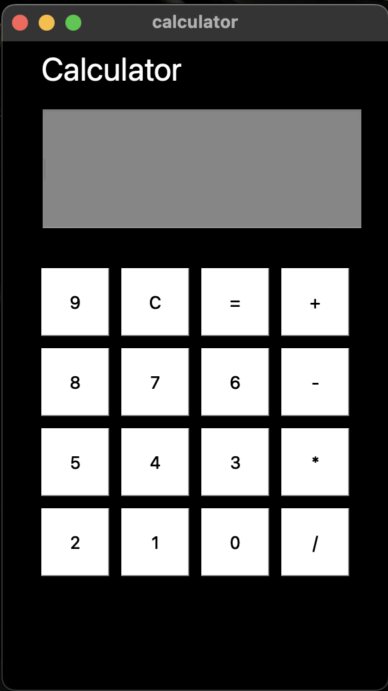

# 🔢 Android Calculator (Qt5 Project)

A clean, fully functional calculator application built using **C++ and Qt5**, styled to resemble the look and feel of an Android calculator. This project is designed to help understand the use of Qt Widgets, signal-slot mechanisms, and GUI design using `.ui` files in Qt Creator.

---

## 📁 Project Structure
<pre>

AndroidCalculator/
├── AndroidCalculator.pro       # Qt project file
├── calculator.ui               # UI design (Qt Designer)
├── calculator.h                # Header file
├── calculator.cpp              # Logic implementation
├── main.cpp                    # Entry point
├── SS.png                      # Screenshot
├── .gitignore                  # Ignores Qt build files
└── README.md                   # This file

</pre>

---

## 🎯 Features

- Responsive UI with Android-like button layout
- Real-time input display
- Basic operations: addition, subtraction, multiplication, division
- Clear (`C`) and backspace (`←`) functionality
- Error handling for invalid operations (e.g., divide by zero)

---

## 🚀 How to Run

1. **Open in Qt Creator**:
   - File → Open File or Project → Select `AndroidCalculator.pro`

2. **Build and Run**:
   - Ensure Qt5 is properly installed
   - Click the Run button in Qt Creator

---

## 🛠️ Tech Stack

- **Language**: C++
- **Framework**: Qt5
- **UI Design**: Qt Designer (`.ui` file)
- **Build System**: qmake (`.pro` file)

---

## 📸 Screenshot

---

## 🧠 Learnings

This project helped reinforce:
- Object-oriented programming in C++
- Qt's signal-slot mechanism
- Using `.ui` files for UI layout
- Event handling and widget interactivity

---

## 📄 License

This project is open-source under the [MIT License](LICENSE).

---

## 🤝 Contributions

Pull requests and feedback are welcome. If you find a bug or have suggestions, feel free to open an issue.

---

## ✨ Author

Developed by **Shivam** – 2025